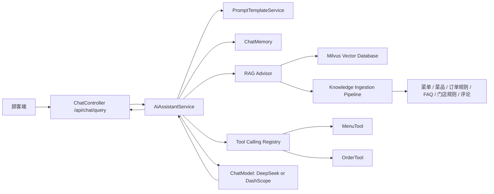

# 沐枫餐饮智能助手升级计划书

**日期:** 2026-05-10

**项目基线:** 当前后端已经具备 Spring Boot 3.5.14、Spring AI 1.1.6、Spring AI Alibaba 1.1.2.2、DeepSeek OpenAI 兼容对话入口、DashScope embedding 配置、Redis 缓存配置、`/api/chat/query` 聊天入口。现有 `ChatService` 仍是规则式菜单推荐和订单状态回复，尚未真正接入 RAG、Tool Calling 和可治理的 Prompt 模板体系。

## 1. 升级目标

将当前规则式聊天入口升级为面向顾客端点餐场景的智能助手，覆盖顾客点餐咨询、订单状态查询、菜品推荐和门店规则问答。

核心目标：

- 建立可检索、可更新、可观测的 RAG 知识库，使用 Milvus 向量数据库，后续通过 `VectorStore` 接口保留切换到其他向量库的可能。
- 建立 Function Calling 工具层，让模型可以安全调用菜单、订单、库存、评价、营业规则等后端能力。
- 建立 Prompt 模板工程体系，将系统提示词、业务角色、RAG 上下文、工具调用规则、输出格式和安全边界从代码中解耦出来。
- 建立评测和监控闭环，用离线问题集、线上反馈和 Prometheus 指标持续优化答案质量、检索命中率和工具调用准确率。

## 2. 目标架构



推荐新增模块边界：

- `ai/assistant`: 智能助手编排，负责 ChatClient、Advisor、Tool、Prompt、Memory 的组装。
- `ai/rag`: 文档构建、切片、embedding、向量写入、检索参数和知识库刷新。
- `ai/tools`: 菜单、订单、评价等顾客端工具定义，统一权限、参数校验和审计日志。
- `ai/prompt`: Prompt 模板加载、版本管理、变量渲染和灰度切换。
- `ai/evaluation`: 离线评测样本、答案评分、检索命中率、工具调用准确率统计。

`AssistantMode` 枚举定义助手运行模式：

| 值 | 说明 |
|----|------|
| `RULE_BASED` | 纯规则式回复，完全不调用 AI（兜底模式） |
| `RAG_ONLY` | 仅使用知识库检索 + LLM 回答，不调用工具 |
| `FULL_AI` | 完整 AI 链路：RAG + Tool Calling + Prompt 模板 |

模式切换由 `app.ai.enabled` + `app.ai.rag.enabled` + `app.ai.tools.enabled` 三个开关组合决定，运行时动态生效。

## 3. RAG 数据库建设计划

### 3.1 知识库范围

第一期知识源：

- 菜品知识：菜名、分类、价格、亮点、口味、过敏原、热量标签、是否售罄。
- 点餐规则：营业时间、配送费、打包费、退款规则、取餐说明、发票说明。
- 订单规则：状态含义、预计制作时间、异常订单处理说明。
- FAQ：顾客常问问题，如推荐、忌口、优惠、支付、取餐、售后。

第二期知识源：

- 评论与评分摘要。
- 活动配置、会员权益和门店公告。
- 历史问答沉淀的高质量答案。

### 3.2 向量库选型

选用 Milvus 向量数据库：

- 专为向量检索设计的分布式数据库，支持十亿级向量规模、毫秒级检索延迟。
- Spring AI 官方提供 `spring-ai-starter-vector-store-milvus`，与现有技术栈无缝集成。
- 支持多 Collection、分区键、复杂 metadata filter、混合检索（BM25 + 向量相似度）。
- 社区活跃、文档完善，CNCF 毕业项目，运维生态成熟。

部署方案：

- 开发环境：Docker Compose 单机 Milvus Standalone（`milvus-standalone`），内含 etcd + minio + milvus 三个进程，最低需 **4GB 可用内存**。
- 生产环境：推荐阿里云托管 Milvus（PAI + Milvus）或自建 Milvus Cluster。
- Milvus SDK 通过 gRPC 直连，不需要额外代理层。

与 Redis 向量检索的对比：

| 维度 | Redis Stack | Milvus |
|------|------------|--------|
| 检索性能 | 适合小规模（<10 万向量） | 适合大规模（百万级以上），HNSW/IVF/DiskANN 多索引 |
| 元数据过滤 | 基于 RediSearch，能力有限 | 原生支持复杂标量过滤、分区键 |
| 多 Collection | 需要手动管理 index 前缀 | 原生多 Collection，可隔离不同知识源 |
| 混合检索 | 不支持 | 原生 BM25 + 向量混合检索 |
| 运维能力 | 无管理界面 | Milvus Attu 可视化、Prometheus 监控集成 |
| 迁移成本 | 低（项目已用 Redis） | 中（新增 docker compose 和 Maven 依赖） |

结论：餐饮知识库虽起步规模不大，但提前使用 Milvus 可以避免后续迁移成本，同时获得更好的检索精度和运维体验。Redis 继续承担缓存和会话存储职责，不再复用为向量库。

### 3.3 文档切片与元数据

建议 chunk 粒度：

- 菜品：一菜一文档，避免切碎菜品属性。
- FAQ：一问一答一文档。
- 门店规则：按主题或小节切片，每片 300 到 800 中文字。
- 规则类文档：按规则主题切片，如取餐、退款、配送费、发票。

统一 metadata：

| 字段 | 示例 | 用途 |
|------|------|------|
| `doc_type` | `dish`, `faq`, `sop`, `policy` | 过滤不同知识类型 |
| `tenant_id` | `default` | 预留多门店 |
| `source_id` | `dish:1001` | 回溯原始数据 |
| `version` | `2026-05-10.1` | 支持增量更新 |
| `status` | `active` | 排除下架和过期知识 |
| `updated_at` | `2026-05-10T12:00:00+08:00` | 检索排序和审计 |

### 3.4 入库与刷新策略

第一期实现三类刷新：

- 启动初始化：开发环境可用 `ApplicationRunner` 初始化菜单和 FAQ。
- 菜单事件刷新：菜品新增、编辑、上下架后，异步重建对应文档向量。
- 手动刷新命令：运维在后端侧触发知识库重建，不提供后台智能助手入口。

启动初始化失败策略：

- 默认 `spring.ai.vectorstore.type=none`，避免 AI/RAG 未启用时 Spring AI 在启动期创建 Milvus 客户端。
- 开启 RAG 联调或生产 RAG 时，显式设置 `SPRING_AI_VECTORSTORE_TYPE=milvus` 并确认 Milvus 可访问；Spring AI Milvus 自动配置会在启动期创建客户端。
- 知识库初始化阶段出现 Embedding API 异常时，**log error 并跳过初始化**，不阻止应用启动。
- 若后续要求“启用 RAG 但 Milvus 不可达仍能启动”，需要把 Milvus VectorStore 从自动配置切换为业务侧条件 Bean，并在连接失败时降级为无 RAG。
- 后续由运维通过后端任务或命令手动触发补齐。
- 若 Milvus Collection 已存在且不为空，跳过初始化避免重复写入。

入库流程：

1. 从 MySQL 和静态 FAQ 配置读取知识源。
2. 转换为 Spring AI `Document`。
3. 写入 metadata。
4. 使用 DashScope embedding 生成向量。
5. 存入 Milvus Collection。
6. 数据写入后调用 `createIndex()` 显式创建索引（Milvus 不会自动索引，未建索引会退化暴力搜索）。
7. 记录索引版本、耗时、成功数、失败数。

### 3.5 检索策略

第一期：

- 使用 `QuestionAnswerAdvisor` 或 `RetrievalAugmentationAdvisor` 接入 `ChatClient`。
- 默认 `topK=5`，相似度阈值建议从 `0.65` 起步，根据评测集调整。
- 按场景加 metadata filter：
  - 顾客咨询：`doc_type in ['dish','faq','policy'] and status == 'active'`
  - 菜品推荐：优先 `dish`，再补充 `faq` 和 `policy`

第二期：

- 增加查询改写：把“适合小朋友吃的”改写为“清淡、不辣、少油、儿童友好菜品推荐”。
- 增加 rerank：对召回文档按业务权重重排，如在售菜品优先、热销优先。
- 增加答案引用：返回命中的知识来源，便于排查幻觉。

### 3.6 会话记忆管理

多轮对话需要保留上下文才能理解指代（如"刚才那个菜有没有不辣的做法"）。Spring AI 提供 `ChatMemory` 接口，第一期使用 `InMemoryChatMemory`（单机内存），通过 `MessageChatMemoryAdvisor` 接入 `ChatClient` 的 Advisor 链。

关键参数：

- `maxHistorySize`：保留最近 N 轮对话，建议默认 10 轮，避免 context window 膨胀导致成本上升和延迟增加。
- `truncateStrategy`：超过上限时截断策略，默认丢弃最早消息。

Advisor 链执行顺序（影响检索质量）：

```
MessageChatMemoryAdvisor → RetrievalAugmentationAdvisor → ToolCallAdvisor → Model
```

若后续部署多实例，直接替换为 `CassandraChatMemory` 或基于 Redis 的自定义实现即可，无需改业务代码。

## 4. Function Calling 建设计划

### 4.1 工具设计原则

- 只读工具优先上线，写操作必须二次确认。
- 每个工具只做一件业务动作，参数结构清晰。
- 工具返回结构化结果，不直接拼接自然语言。
- 工具必须经过权限、租户、参数和业务状态校验。
- 对工具调用记录审计日志：用户、工具名、参数摘要、耗时、结果状态。

### 4.2 第一期工具清单

| 工具 | 能力 | 权限 | 风险等级 |
|------|------|------|----------|
| `getMenu` | 查询当前菜单、分类、价格、上下架状态 | 顾客 | 低 |
| `searchDishes` | 按口味、价格、分类、关键词搜索菜品 | 顾客 | 低 |
| `recommendDishes` | 根据人数、忌口、预算、偏好推荐菜品 | 顾客 | 低 |
| `getOrderStatus` | 根据订单号查询订单状态，支持附带解释下一步动作 | 顾客 | 中 |
| `getBusinessRules` | 查询营业时间、配送费、取餐规则 | 顾客 | 低 |

### 4.3 第二期工具清单

| 工具 | 能力 | 权限 | 风险等级 |
|------|------|------|----------|
| `createOrderDraft` | 生成订单草稿，不直接下单 | 顾客 | 中 |
| `summarizeCustomerReviews` | 汇总公开评论中的菜品口味反馈，用于回答顾客推荐问题 | 顾客 | 中 |

### 4.4 工具调用流程

1. 模型识别用户意图。
2. ChatClient 携带可用工具定义。
3. 模型选择工具并生成结构化参数。
4. 后端执行参数校验和权限校验。
5. 工具调用业务 Service。
6. 工具返回结构化结果。
7. 模型基于工具结果组织最终回答。
8. 审计日志记录工具调用链路。

### 4.5 工具安全边界

高风险工具上线前必须满足：

- 二次确认机制，例如模型先返回“待确认动作”，前端展示确认按钮，再调用执行接口。
- 幂等键，避免重复执行。
- 限流和熔断，避免模型循环调用造成业务压力。
- 工具白名单，禁止模型通过自由文本调用未注册能力。

## 5. Prompt 工程模板优化计划

### 5.1 模板分层

建议拆成 6 层：

- System Prompt：助手身份、安全边界、回答原则。
- Role Prompt：顾客助手场景角色（如点餐推荐、订单查询、FAQ 问答）。
- Task Prompt：点餐推荐、订单查询、FAQ 问答。
- RAG Context Prompt：引用知识库内容时的规则。
- Tool Prompt：何时调用工具、何时不调用工具、工具失败如何处理。
- Output Prompt：输出格式、语气、字段约束、是否需要追问。

### 5.2 顾客端基础 System Prompt

```text
你是“沐枫餐饮”的智能点餐助手。
你需要用简洁、温和、确定的中文回答顾客问题。
回答必须优先依据工具返回结果和知识库内容。
如果知识库和用户描述冲突，以知识库和工具结果为准，并说明“以当前系统展示为准”。
涉及价格、库存、订单状态、营业规则时，必须调用工具或使用检索到的上下文。
不要编造不存在的菜品、优惠、订单状态或门店规则。
当用户意图不明确时，先提出一个最关键的澄清问题。
```

### 5.3 RAG 上下文模板

```text
以下是从沐枫知识库检索到的上下文，只能作为回答依据，不要泄露内部字段名。

{context}

回答要求：
1. 如果上下文足以回答，直接回答。
2. 如果上下文不足，说明暂未查询到准确信息，并给出可执行的下一步。
3. 如果涉及菜品、价格或订单状态，提醒用户以页面实时展示为准。
4. 不要输出没有依据的承诺。
```

### 5.4 菜品推荐任务模板

```text
用户需求：
{user_message}

已知偏好：
- 人数：{party_size}
- 预算：{budget}
- 忌口：{dietary_restrictions}
- 口味：{taste_preferences}

请根据当前菜单和知识库推荐 2 到 4 个菜品。
每个推荐包含：菜名、推荐理由、适合人群或场景、注意事项。
如果用户没有给出忌口或预算，先基于当前菜单给出稳妥推荐，并询问是否有忌口。
```

### 5.5 工具异常回退模板（tool-fallback.st）

```text
抱歉，当前无法查询到相关数据（工具未返回结果）。

建议：
1. 稍后重试，或刷新页面查看实时数据。
2. 如果问题持续，请联系店员协助。

其他我能帮到你的，可以直接告诉我。
```

### 5.6 Prompt 治理

第一期将模板存放在 `src/main/resources/prompts/*.st`：

- `customer-system.st`
- `rag-context.st`
- `dish-recommendation.st`
- `order-status.st`
- `tool-fallback.st`

第二期将 Prompt 模板表化：

- `prompt_template` 表记录模板编码、版本、场景、内容、启用状态。
- 支持灰度版本，如 `customer-system:v2`。
- 支持配置化查看和回滚。
- 关键模板修改记录审计日志。

## 6. 分阶段实施计划

### 阶段 0：基线整理和开关保护

周期：0.5 到 1 天。

交付物：

- 明确 AI 功能开关：`app.ai.enabled`、`app.ai.rag.enabled`、`app.ai.tools.enabled`。
- 保留现有规则式 `ChatService` 作为 fallback。
- 升级 Spring AI 至 `1.1.6`，规避 1.1.x 早期版本的向量过滤表达式安全风险，并验证 Spring AI Alibaba `1.1.2.2` 兼容性。
- 梳理 DeepSeek ChatModel、DashScope EmbeddingModel、Milvus VectorStore 的启动条件。
- 使用 `spring.ai.vectorstore.type` 控制向量库自动配置：默认 `none`，启用 RAG 时改为 `milvus`。
- 添加 `spring-ai-starter-vector-store-milvus` Maven 依赖，替换原有 `spring-ai-starter-vector-store-redis`。
- 添加 `spring-ai-advisors-vector-store` 和 `spring-ai-rag`，确保 `QuestionAnswerAdvisor` / `RetrievalAugmentationAdvisor` 可用。
- `compose.yml` 增加 Milvus Standalone 容器及其依赖（etcd、minio），确保本地可一键启动。
- 补充本地启动说明和环境变量检查。

验收标准：

- 未配置模型密钥时，原系统可以正常启动。
- AI 开关关闭时，`/api/chat/query` 仍返回现有规则式答案。

### 阶段 1：RAG 最小可用版本

周期：2 到 3 天。

交付物：

- `KnowledgeDocumentBuilder`：把菜单、FAQ、规则转换为 `Document`。
- `KnowledgeIngestionService`：写入 Milvus Collection。
- `KnowledgeRefreshRunner`：启动或运维命令触发知识库刷新。
- `AiAssistantService`：通过 RAG Advisor 回答菜单、FAQ、规则问题。
- RAG 评测集：至少 30 个问题，覆盖菜品、规则、订单状态解释。

验收标准：

- 能回答“有什么不辣的推荐”“打包费多少”“订单 READY 是什么意思”。
- 检索命中文档可在日志中追踪。
- 评测集准确率达到 80% 以上。

### 阶段 2：Function Calling 只读工具

周期：2 到 3 天。

交付物：

- `MenuTools`：菜单查询、菜品搜索、推荐候选。
- `OrderTools`：订单状态查询和状态解释。
- `BusinessRuleTools`：营业规则查询。
- 工具调用审计日志。
- 工具参数校验和异常 fallback 模板。

验收标准：

- 用户提供订单号时，模型调用 `getOrderStatus`，而不是凭空回答。
- 菜品推荐优先调用菜单工具，避免推荐已下架菜品。
- 工具失败时给出温和可执行的错误说明。

### 阶段 3：Prompt 模板工程化

周期：1 到 2 天。

交付物：

- `PromptTemplateService`：加载、渲染和缓存模板。
- 6 个基础 Prompt 模板文件。
- 顾客端 system prompt。
- Prompt 版本号进入日志和响应 metadata。

验收标准：

- 模板变更无需修改核心业务 Service。
- 同一问题可以追踪使用了哪个模板版本。
- 输出风格稳定，不泄露工具参数和内部字段。

### 阶段 4：前端体验接入

周期：2 到 3 天。

交付物：

- 顾客端菜单页增加智能助手入口。
- 聊天消息支持 loading、失败重试、引用来源、工具执行提示。
- 保留 `/api/chat/query` JSON 契约，新增 `/api/chat/stream` 返回 `text/event-stream`，前端逐字渲染减少等待感知。
- 高风险动作使用确认按钮，不让模型直接执行。

验收标准：

- 顾客可以自然语言询问推荐、忌口、订单状态。
- 移动端输入和消息区域不遮挡下单流程。

### 阶段 5：评测、监控和灰度

周期：2 天。

交付物：

- 离线评测脚本或 JUnit 测试。
- 关键指标：AI 请求量、模型耗时、RAG 检索耗时、工具调用次数、工具失败率、fallback 次数、每次请求的 token 消耗（prompt + completion）。
- 顾客端反馈入口：有用、无用、问题类型。
- 灰度开关：仅指定顾客端用户或会话启用 AI 新链路。

验收标准：

- 线上可观测每次回答的模型、模板、检索、工具链路。
- 出现异常时可以一键关闭 RAG 或 Tool Calling。
- 评测集持续通过，关键问题无明显幻觉。

## 7. 推荐文件落点

```text
backend/src/main/java/com/example/ordering/ai/
├── assistant/
│   ├── AiAssistantService.java
│   ├── AiAssistantProperties.java
│   └── AssistantMode.java
├── rag/
│   ├── KnowledgeDocumentBuilder.java
│   ├── KnowledgeIngestionService.java
│   ├── KnowledgeRefreshRunner.java
│   └── RagProperties.java
├── tools/
│   ├── MenuTools.java
│   ├── OrderTools.java
│   ├── BusinessRuleTools.java
│   └── ToolAuditService.java
├── prompt/
│   ├── PromptTemplateService.java
│   └── PromptTemplateProperties.java
└── evaluation/
    ├── AiEvaluationCase.java
    └── AiEvaluationService.java

backend/src/main/resources/prompts/
├── customer-system.st
├── rag-context.st
├── dish-recommendation.st
├── order-status.st
└── tool-fallback.st
```

## 8. 配置建议

```yaml
app:
  ai:
    enabled: ${APP_AI_ENABLED:false}
    rag:
      enabled: ${APP_AI_RAG_ENABLED:false}
      top-k: ${APP_AI_RAG_TOP_K:5}
      similarity-threshold: ${APP_AI_RAG_SIMILARITY_THRESHOLD:0.65}
    tools:
      enabled: ${APP_AI_TOOLS_ENABLED:false}
      audit-enabled: true
    prompt:
      version: ${APP_AI_PROMPT_VERSION:v1}

spring:
  ai:
    model:
      chat: ${SPRING_AI_MODEL_CHAT:none}
      embedding: ${SPRING_AI_MODEL_EMBEDDING:none}
    vectorstore:
      type: ${SPRING_AI_VECTORSTORE_TYPE:none}
      milvus:
        client:
          host: ${MILVUS_HOST:localhost}
          port: ${MILVUS_PORT:19530}
          username: ${MILVUS_USERNAME:root}
          password: ${MILVUS_PASSWORD:Milvus}
        database-name: ${MILVUS_DATABASE_NAME:default}
        collection-name: ${MILVUS_COLLECTION_NAME:mufeng_kb}
        embedding-dimension: ${MILVUS_EMBEDDING_DIMENSION:1024}
        index-type: ${MILVUS_INDEX_TYPE:IVF_FLAT}
        metric-type: ${MILVUS_METRIC_TYPE:COSINE}
        initialize-schema: ${SPRING_AI_VECTORSTORE_MILVUS_INITIALIZE_SCHEMA:false}
```

## 9. 测试计划

单元测试：

- Prompt 模板变量渲染测试。
- KnowledgeDocumentBuilder 文档和 metadata 测试。
- Tool 参数校验、权限校验、异常 fallback 测试。
- `ChatService` 关闭 AI 时保留原有规则式回复测试。

集成测试：

- Milvus 向量写入和检索。
- RAG 问答链路。
- Tool Calling 链路。
- 未配置 API Key 时应用启动测试。

评测样本：

- 菜品推荐 10 条。
- 营业规则 8 条。
- 订单状态 6 条。
- 门店规则 6 条。
- 反幻觉和越权问题 10 条。

## 10. 风险与控制

| 风险 | 表现 | 控制措施 |
|------|------|----------|
| 幻觉 | 编造菜品、价格、优惠 | RAG + 工具优先，回答中强调实时页面为准 |
| 越权 | 顾客查询他人订单或管理数据 | JWT、订单号校验、工具权限分级 |
| 工具误执行 | 模型直接修改订单或上下架菜品 | 写操作二次确认，第一期只读工具上线 |
| 成本失控 | 高频聊天导致模型费用上升 | 限流、缓存、短回答、RAG topK 控制、token 用量计数 |
| 延迟过高 | RAG + 工具 + 模型链路变慢 | 超时、fallback、异步日志、指标监控 |
| 知识过期 | 菜品下架后仍被推荐 | 菜单事件触发向量刷新，metadata status 过滤 |

## 11. 里程碑排期

建议 2 周完成 MVP，3 到 4 周达到可灰度上线水平。

| 周期 | 重点 | 结果 |
|------|------|------|
| 第 1 到 2 天 | 基线整理、开关保护、Prompt 初稿 | AI 能安全关闭和 fallback |
| 第 3 到 5 天 | RAG 知识库和检索问答 | 能基于菜单和 FAQ 回答 |
| 第 6 到 8 天 | 只读 Function Calling | 能查菜单、查订单、查规则 |
| 第 9 到 10 天 | 顾客端前端接入 | 顾客端可试用 |
| 第 11 到 14 天 | 评测、监控、灰度 | 可小流量上线 |

## 12. MVP 验收清单

- [ ] AI 开关关闭时，现有菜单、订单接口不受影响。
- [ ] Milvus 中能看到知识库 Collection 和文档向量。
- [ ] 顾客能询问菜品推荐、忌口、取餐规则、订单状态。
- [ ] 订单状态问题必须通过工具查询。
- [ ] 菜品推荐不推荐下架菜品。
- [ ] Prompt 模板文件化，响应日志包含模板版本。
- [ ] RAG 命中文档、工具调用和模型耗时可观测。
- [ ] 离线评测集准确率达到 80% 以上。
- [ ] 出现模型或向量库异常时可以 fallback 到规则式回复。

## 13. 参考资料

- Spring AI Milvus Vector Store 官方文档: https://docs.spring.io/spring-ai/reference/api/vectordbs/milvus.html
- Spring AI Tool Calling 官方文档: https://docs.spring.io/spring-ai/reference/api/tools.html
- Spring AI RAG 官方文档: https://docs.spring.io/spring-ai/reference/api/retrieval-augmented-generation.html
- Spring AI Prompt Template 官方文档: https://docs.spring.io/spring-ai/reference/api/prompt.html
- Milvus 官方文档: https://milvus.io/docs
- Spring AI Alibaba Extensions: https://github.com/spring-ai-alibaba/spring-ai-extensions
- Spring AI Alibaba RAG 文档: https://java2ai.com/en/ecosystem/spring-ai/reference/RAG/
